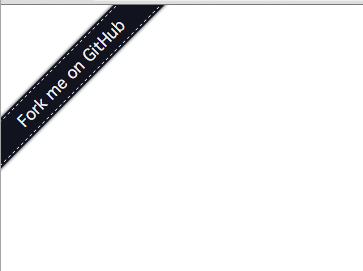

# GITFORKER

Using images for "Fork me on GitHub" is lame.

## Use

    

### Options

  - `url` -
    Full url of your GitHub Repo.
    Required.
  - `orientation` -
    Places the banner on the left or right of the screen.
    Default: `left`
  - `bg` -
    Background color of the banner.
    Deafult: `#121520`
  - `fg` -
    Foreground color of the banner.
    Deafult: `#eeeeee`
